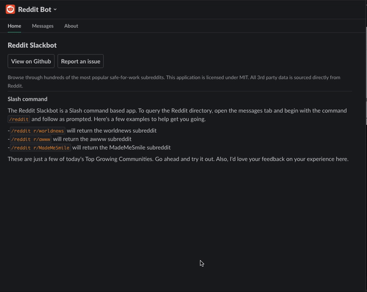

# Reddit Slack bot


Browse through the most popular safe-for-work subreddits directly from <s>any</s> the <a href="https://join.slack.com/t/ghstsolutions/shared_invite/zt-s0jyi58m-SU2Gr9XMKUTnJbUcEiAXoQ">Ghst Solutions Slack Workspace</a>. This application is licensed under MIT. All 3rd party data is sourced directly from Reddit. 

<p align="center">
  
</p>

Preview live <a href="https://join.slack.com/t/ghstsolutions/shared_invite/zt-s0jyi58m-SU2Gr9XMKUTnJbUcEiAXoQ">@ Ghst Solutions Slack Workspace</a>

## Slash Commands
Command Name | Optional parameters | Description 
---          |  ---                | ---
/reddit      | r/any-subreddit     | The quickest way to browse is via the `/reddit` command. If no parameters are passed, the bot will display the reddit home page. If a valid parameter is passed, the bot will attempt to fetch or throw `"Whoops. Something went wrong"`.

## Start here :wave:

This application was built to experiment with Slacks Bolt library. It is simply a fun proof of concept. 🎆 

## Local Setup

This app runs locally on [ngrok](https://ngrok.com/download). Let's summarize what we will need to do to get started.

- [Set environmental variables](#set-environmental-variables)
- [Start ngrok server](#start-ngrok-server)
- [Start express app](#start-express-app)
- [Frequent reasons this process might fail](#frequent-reasons-this-process-might-fail)

### Set environmental variables

Create the `.env.local` file. We can start by renaming the `.env.example` to match the dotenv declaration. 

```sh
# rename .env.example to .env.local
mv .env.example .env.local
```

### Start ngrok server

```sh
~/ngrok http 3009
```

Once the ngrok server is online we will need to update the URLs we plan on using via https://api.slack.com/apps. _We are going to refer to `https://e6829b5713d5.ngrok.io` as the base URL for this example. Keep in mind you will be assigned a unique temporary ngrok URL when running the above command_


- [ ] **Features > Slash Commands**
  - `/reddit` | https://e6829b5713d5.ngrok.io/slack/events
- [ ] **Features > Event Subscriptions > Request URL** 
  - https://e6829b5713d5.ngrok.io/slack/events
- [ ] **Features > Interactivity & Shortcuts > Request URL** 
  - https://e6829b5713d5.ngrok.io/slack/events

### build local PostgreSQL database

Installs from the Slack app will need to preserve unique information, since we are deploying to Heroku this seems like the most logic choice. This project is configured to use the `reddit_slackbot` database, let's create that from within the PostgreSQL terminal.

```sql
-- run this command once to create the database
CREATE DATABASE reddit_slackbot
```

Now we can run the seed scripts to create the tables within our database, again this will be a one time command. Depending on your environment setup, you may be able to run the npm `db:create_tables` script. Alternatively if not using the `postgresql` as the primary user we can run the same command manually. 

e.g
```sh
psql -U $USER -d reddit_slackbot -f ./database/init.sql
```

Let's also take a moment to verify the credentials used here also match the local database url used in the .env.example file. Once we've built the local database, we are ready to start the Bolt app.

### Start the Bolt app 

**What is Bolt?** For our understanding and general context, Bolt is a wrapper that sits on top of an Express server, used to Slack applications.

Now we are ready to set up our source code. Assuming we have **set our environmental variables** this should be a quick and painless process. 

```sh
# install project dependencies
npm install

# we ignore /dist by default
# let's build that
npm run build 

# start the Bolt app
npm run start
```

At this point we should be presented with the standard `app listening on http://localhost:3009` message in the terminal. This is a great point to begin testing your Slack connections.

### Frequent reasons this process might fail

- **Your environmental variables aren't being read by dotenv.**  

Check out the [./lib/index.ts](./lib/index.ts) file and verify that your `.env.local` file matches the absolute path specified in the `dotenv.config()` method.

```ts
const path = require('path');
// ...
// Configures local environment
require('dotenv').config({path: path.resolve(__dirname, "../.env.local")});

// DEBUGGING
console.log(path.resolve(__dirname, "../.env.local"));
```

- **Slack App does not have required permissions**
- **Ngrok server shut down and needs to be restarted** 
By default the ngrok URL is active for 2 hours at which point it will automatically timeout. When we reset the ngrok server we will need to update the base URL as defined in the [Start ngrok server](#start-ngrok-server) section. 

This can be easily identify as the root issue to most unexpected errors. Be sure to keep an eye on your ngrok server throughout development.

- **[Slash Commands] Reddit Bot needs to be invited to the channel** 
Found this to be the case when migrating to @slack/bolt. [This thread on Stack Overflow](https://stackoverflow.com/questions/60198159/slack-api-conversations-history-returns-error-not-in-channel) helped provide a solution. 

## Contributing & more questions

To get involved, pick the brains of the developrs, or just hang out head over to the <a href="https://join.slack.com/t/ghstsolutions/shared_invite/zt-s0jyi58m-SU2Gr9XMKUTnJbUcEiAXoQ">@Ghst Solutions Slack Workspace</a> 
